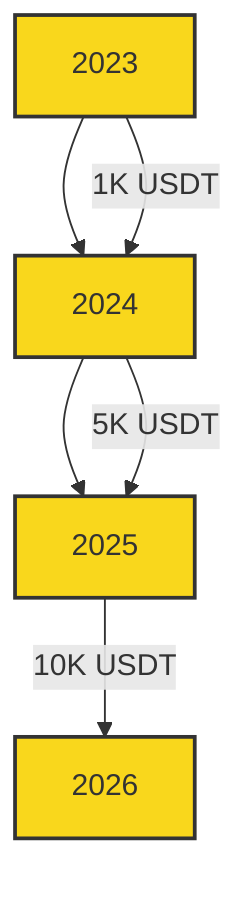

<div align="center">

# ⚡️ Flash USDT Sender Pro 💎


### 🚀 The Premier Solution for Lightning-Fast USDT Transactions Across Multiple Chains 🌐

[✨ Features](#-features) • [💼 Pricing](#-pricing) • [🚀 Quick Start](#-quick-start) • [🛟 Support](#-support) • [🤝 Community](#-community)

</div>

## 🌟 Features

<table>
  <tr>
    <td align="center"><br><b>Instant Activation</b></td>
    <td align="center"><br><b>Atomic Wallet Support</b></td>
    <td align="center"><br><b>Multi-Chain</b></td>
    <td align="center"><br><b>Flash Transfers</b></td>
  </tr>
  <tr>
    <td align="center">Activate in seconds</td>
    <td align="center">Seamless integration</td>
    <td align="center">ETH, BSC, & more</td>
    <td align="center">Lightning speed</td>
  </tr>
</table>

## 💰 Pricing

<div align="center">

| Package | Price | Features | Best For |
|---------|-------|----------|----------|
| 🥈 Silver | $200 | Basic features | Beginners |
| 🥇 Gold | $300 | Advanced features | Experienced Users |
| 💎 Platinum | $400 | All features + Priority Support | Power Users & Businesses |

</div>

## 📊 Transaction Volume Projection



## 🚀 Quick Start

1. 📥 Download the software from our [official website](https://scripters.shop).
2. 🔑 Enter your unique activation code provided upon purchase.
3. 🖥️ Launch the software and configure your wallet settings.
4. 💸 Start making lightning-fast USDT transfers across multiple chains!

## 🛟 Support

<div align="center">

[📧 Email Support](mailto:support@scripters.shop) • [💬 Live Chat](https://scripters.shop/chat) • [📚 Documentation](https://docs.scripters.shop)

</div>

## 🤝 Community

- 🤖 **Telegram:** [Join Our Chat](https://t.me/ScriptsChats)
- 🍃 **Author Updates:** [Follow Here](https://t.me/ScriptersNetwork)

## 💖 Support Our Journey

We appreciate your belief in our vision! Your support helps us continue improving Flash USDT Sender Pro.

**Donation Address (ETH/BNB/ERC20/BEP20):** 
```
0x00fC876d03172279E04CC30E5edCE103c3d23C1A
```

🔗 **Contribute Now**: [Donate Here](https://scripters.shop/)

## ⚠️ Disclaimer

<div align="center">

This software is intended for use in accordance with all applicable laws and regulations. Users are responsible for ensuring their own compliance.

</div>

<div align="center">

### 💎 Thank you for choosing Flash USDT Sender Pro! 💎


</div>
