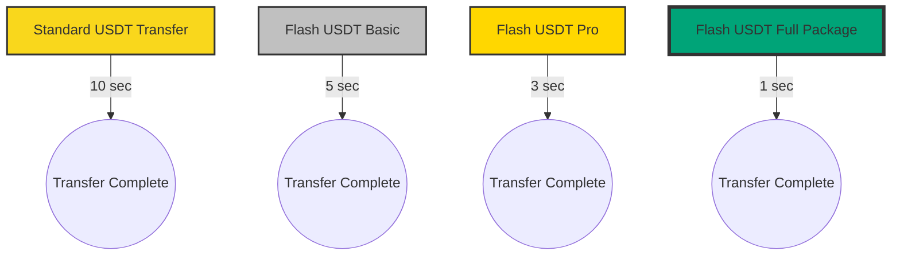
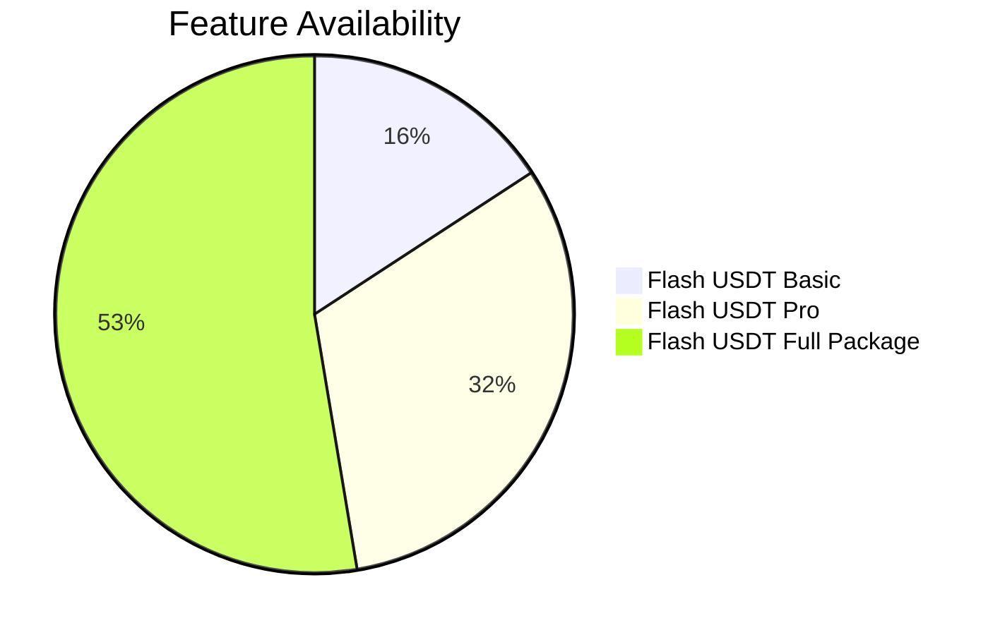
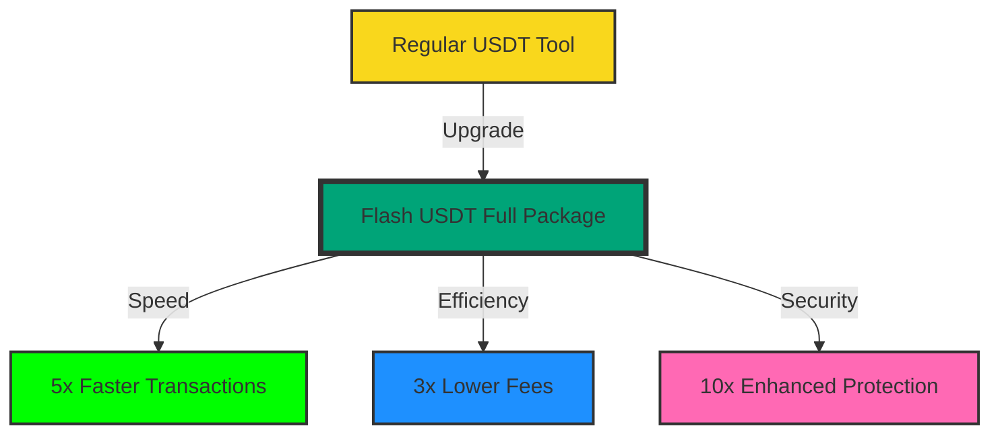

<div align="center">

# ⚡️ Flash USDT Ecosystem 💎


### 🚀 Revolutionize Your Crypto Experience with Lightning-Fast Solutions 🌐

[✨ Features](#-features) • [💼 Products & Pricing](#-products--pricing) • [📊 Performance](#-performance) • [🚀 Quick Start](#-quick-start) • [🛟 Support](#-support) • [🤝 Community](#-community)

<br>

[](https://scripters.shop/product/flash-usdt-full-package/?v=402f03a963ba#reviews)
[](https://scripters.shop/product/flash-usdt-full-package/?v=402f03a963ba#reviews)

</div>

## 🌟 Features

<table>
  <tr>
    <td align="center"><br><b>Lifetime Updates</b></td>
    <td align="center"><br><b>Compact Size</b></td>
    <td align="center"><br><b>Multi-Platform</b></td>
    <td align="center"> <br><b>Global Access</b></td>
</td>
  </tr>
  <tr>
    <td align="center">Stay cutting-edge</td>
    <td align="center">Optimized at 119 MB</td>
    <td align="center">Windows, Mac, Android, Linux</td>
    <td align="center">Worldwide availability</td>
  </tr>
</table>

## 💼 Products & Pricing

<div align="center">

| Product | One-Time Price | Monthly Subscription | Annual Subscription | Features |
|---------|----------------|----------------------|---------------------|----------|
| 🥈 Flash USDT Basic | $200 | $20/month | $200/year | Essential features for beginners |
| 🥇 Flash USDT Pro | $350 | $35/month | $350/year | Advanced tools for experienced users |
| 💎 Flash USDT Full Package | ~~$550~~ $500 | $50/month | $500/year | Complete suite with priority support |
| 🚀 Flash Bitcoin Tool | $400 | $40/month | $400/year | Specialized Bitcoin transactions |

[🛒 Shop Now](https://scripters.shop/products/)

</div>

## 📊 Performance

### Transaction Speed Comparison



### Feature Comparison



## 🚀 Quick Start

1. 📥 Choose and [download](https://scripters.shop/products/) your preferred Flash USDT package.
2. 🔑 Activate with your unique code (provided upon purchase).
3. 🖥️ Install on your device (compatible with Windows/Mac/Android/Linux).
4. 💸 Start enjoying lightning-fast crypto transactions!
5. 
## 📊 Performance Boost



## 🛟 24/7 Expert Support

<div align="center">

[📧 Email](mailto:support@scripters.shop) • [💬 Live Chat](https://scripters.shop/chat) • [📚 Documentation](https://docs.scripters.shop)

</div>

## 🤝 Community

- 🤖 **Telegram:** [Join Our Chat](https://t.me/ScriptsChats)
- 🍃 **Author Updates:** [Follow Here](https://t.me/ScriptersNetwork)

## 💖 Support Our Vision

Help us push the boundaries of crypto technology!

**Donation Address (Multi-Chain Compatible):** 
```
0x00fC876d03172279E04CC30E5edCE103c3d23C1A
```

🔗 **Contribute:** [Donate Here](https://scripters.shop/)

## ⚠️ Disclaimer

<div align="center">

Our products are designed for legitimate use within the bounds of applicable laws and regulations. Users are responsible for ensuring compliance in their jurisdiction.

</div>

<div align="center">

### 💎 Elevate Your Crypto Game with Flash USDT Ecosystem! 💎


</div>
Last updated: Wed Aug 14 05:15:10 UTC 2024
Last updated: Wed Aug 14 06:21:13 UTC 2024
Last updated: Wed Aug 14 07:14:06 UTC 2024
Last updated: Wed Aug 14 08:19:15 UTC 2024
Last updated: Wed Aug 14 09:16:13 UTC 2024
Last updated: Wed Aug 14 10:16:22 UTC 2024
Last updated: Wed Aug 14 11:13:31 UTC 2024
Last updated: Wed Aug 14 12:29:49 UTC 2024
Last updated: Wed Aug 14 13:18:42 UTC 2024
Last updated: Wed Aug 14 14:14:33 UTC 2024
Last updated: Wed Aug 14 15:15:44 UTC 2024
Last updated: Wed Aug 14 16:21:38 UTC 2024
Last updated: Wed Aug 14 17:13:08 UTC 2024
Last updated: Wed Aug 14 18:19:59 UTC 2024
Last updated: Wed Aug 14 19:13:44 UTC 2024
Last updated: Wed Aug 14 20:15:47 UTC 2024
Last updated: Wed Aug 14 21:14:03 UTC 2024
Last updated: Wed Aug 14 22:15:10 UTC 2024
Last updated: Thu Aug 15 02:21:29 UTC 2024
Last updated: Thu Aug 15 04:17:37 UTC 2024
Last updated: Thu Aug 15 05:15:10 UTC 2024
Last updated: Thu Aug 15 06:21:21 UTC 2024
Last updated: Thu Aug 15 07:13:49 UTC 2024
Last updated: Thu Aug 15 08:19:14 UTC 2024
Last updated: Thu Aug 15 10:17:56 UTC 2024
Last updated: Thu Aug 15 11:12:37 UTC 2024
Last updated: Thu Aug 15 12:29:43 UTC 2024
Last updated: Thu Aug 15 13:17:55 UTC 2024
Last updated: Thu Aug 15 14:13:28 UTC 2024
Last updated: Thu Aug 15 15:15:19 UTC 2024
Last updated: Thu Aug 15 16:19:13 UTC 2024
Last updated: Thu Aug 15 17:13:13 UTC 2024
Last updated: Thu Aug 15 18:20:38 UTC 2024
Last updated: Thu Aug 15 19:12:00 UTC 2024
Last updated: Thu Aug 15 20:16:13 UTC 2024
Last updated: Thu Aug 15 21:15:30 UTC 2024
Last updated: Thu Aug 15 22:15:01 UTC 2024
Last updated: Thu Aug 15 23:13:13 UTC 2024
Last updated: Fri Aug 16 01:08:49 UTC 2024
Last updated: Fri Aug 16 02:34:37 UTC 2024
Last updated: Fri Aug 16 03:18:48 UTC 2024
Last updated: Fri Aug 16 04:17:46 UTC 2024
Last updated: Fri Aug 16 05:14:47 UTC 2024
Last updated: Fri Aug 16 06:20:43 UTC 2024
Last updated: Fri Aug 16 07:14:44 UTC 2024
Last updated: Fri Aug 16 08:19:36 UTC 2024
Last updated: Fri Aug 16 10:16:40 UTC 2024
Last updated: Fri Aug 16 12:29:29 UTC 2024
Last updated: Fri Aug 16 13:17:49 UTC 2024
Last updated: Fri Aug 16 14:13:46 UTC 2024
Last updated: Fri Aug 16 15:14:58 UTC 2024
Last updated: Fri Aug 16 16:20:18 UTC 2024
Last updated: Fri Aug 16 17:13:13 UTC 2024
Last updated: Fri Aug 16 18:20:16 UTC 2024
Last updated: Fri Aug 16 19:13:19 UTC 2024
Last updated: Fri Aug 16 20:16:27 UTC 2024
Last updated: Fri Aug 16 22:14:32 UTC 2024
Last updated: Fri Aug 16 23:15:27 UTC 2024
Last updated: Sat Aug 17 01:06:49 UTC 2024
Last updated: Sat Aug 17 02:32:23 UTC 2024
Last updated: Sat Aug 17 03:16:04 UTC 2024
Last updated: Sat Aug 17 04:19:36 UTC 2024
Last updated: Sat Aug 17 05:15:31 UTC 2024
Last updated: Sat Aug 17 06:19:31 UTC 2024
Last updated: Sat Aug 17 07:12:58 UTC 2024
Last updated: Sat Aug 17 08:17:47 UTC 2024
Last updated: Sat Aug 17 09:14:04 UTC 2024
Last updated: Sat Aug 17 10:15:04 UTC 2024
Last updated: Sat Aug 17 11:12:31 UTC 2024
Last updated: Sat Aug 17 12:26:30 UTC 2024
Last updated: Sat Aug 17 13:15:21 UTC 2024
Last updated: Sat Aug 17 14:14:10 UTC 2024
Last updated: Sat Aug 17 16:20:03 UTC 2024
Last updated: Sat Aug 17 17:11:55 UTC 2024
Last updated: Sat Aug 17 18:19:05 UTC 2024
Last updated: Sat Aug 17 19:12:12 UTC 2024
Last updated: Sat Aug 17 20:15:12 UTC 2024
Last updated: Sat Aug 17 22:13:00 UTC 2024
Last updated: Sat Aug 17 23:13:36 UTC 2024
Last updated: Sun Aug 18 01:13:13 UTC 2024
